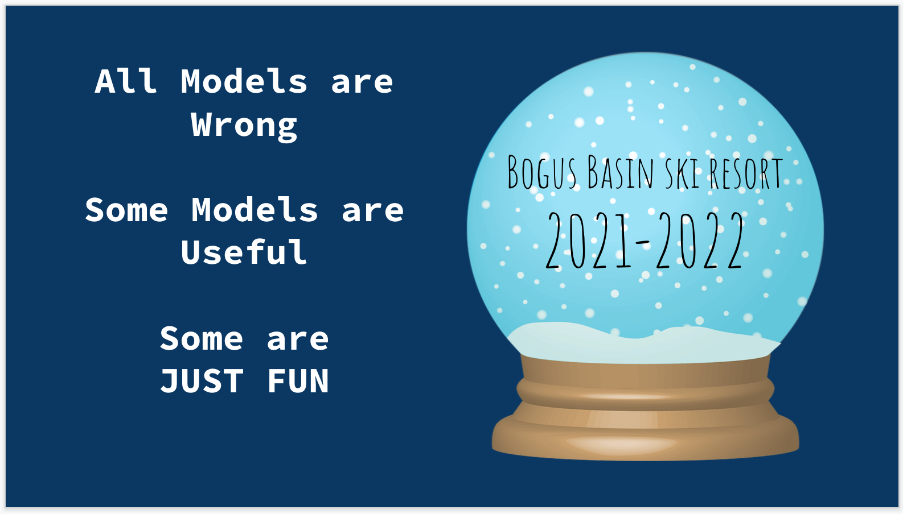
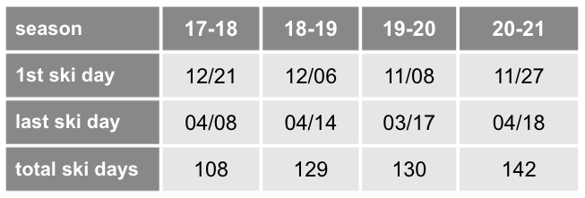
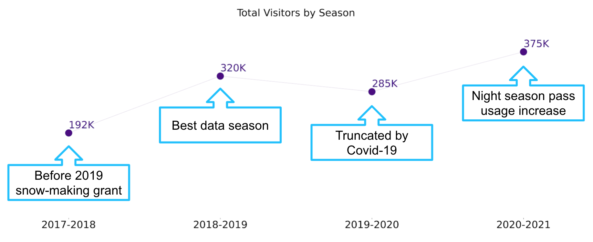
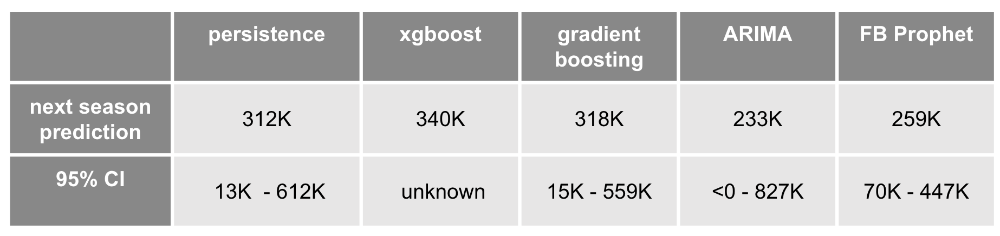
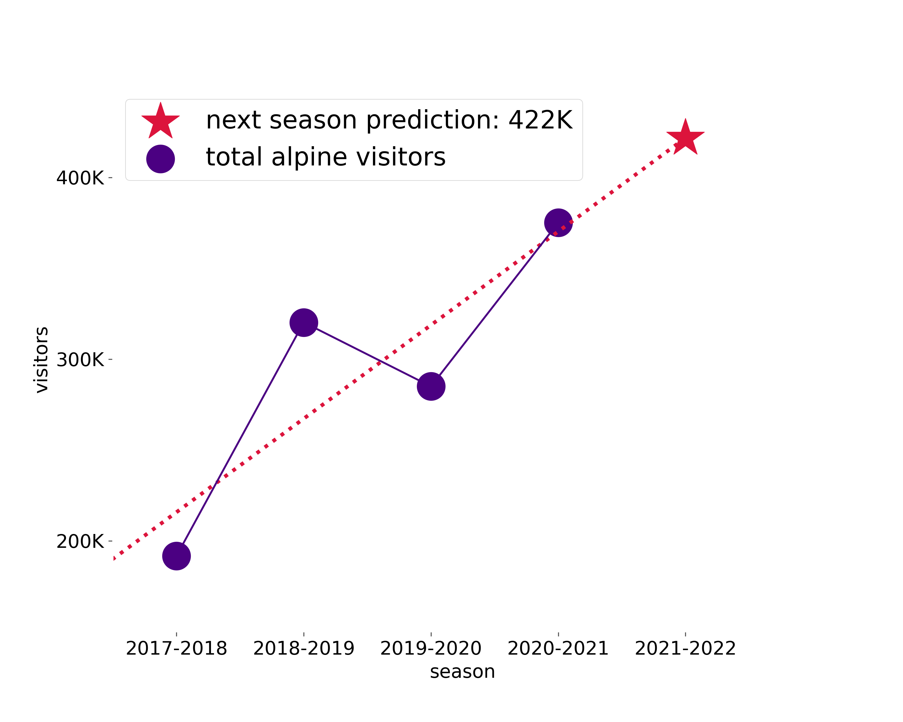
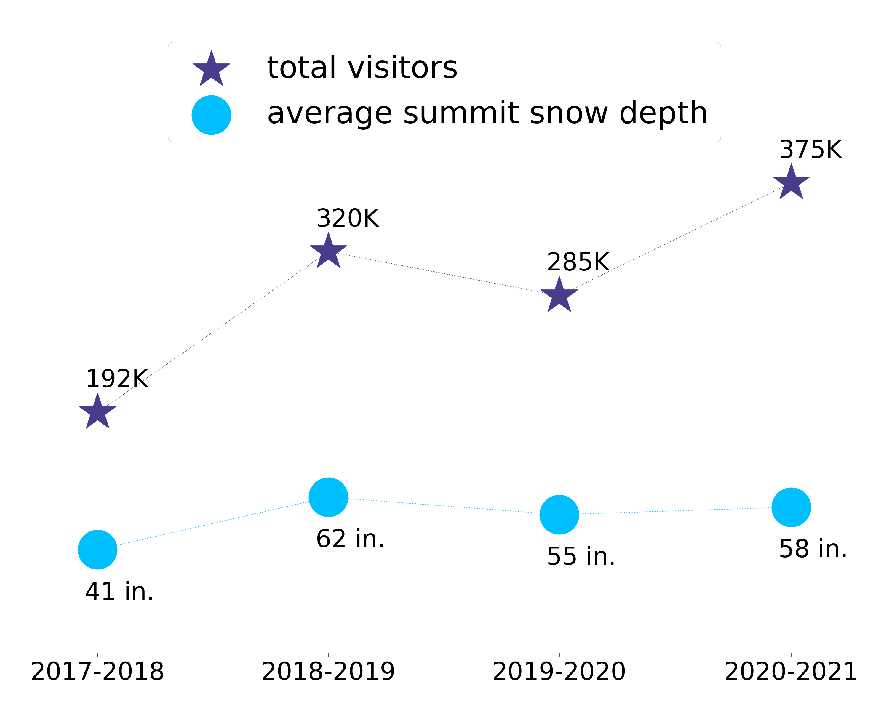
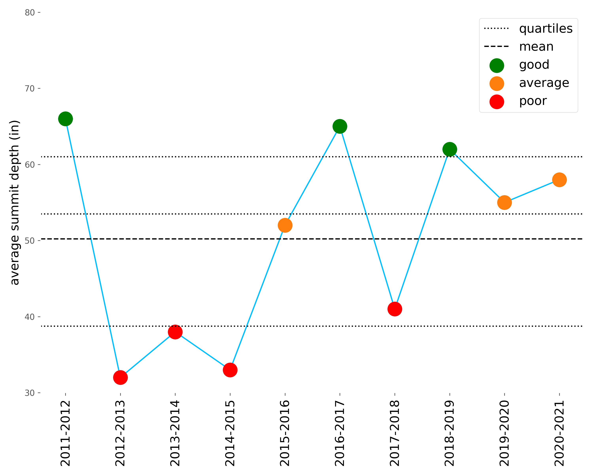
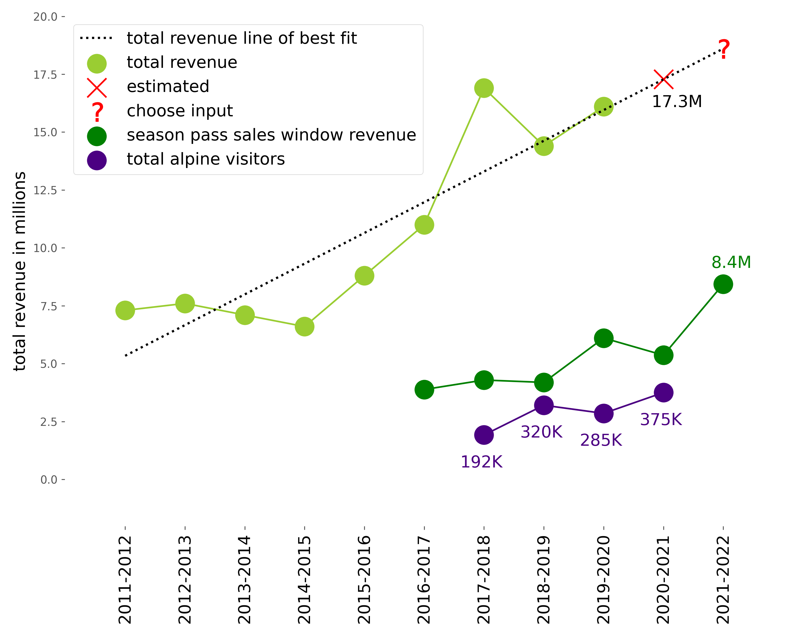
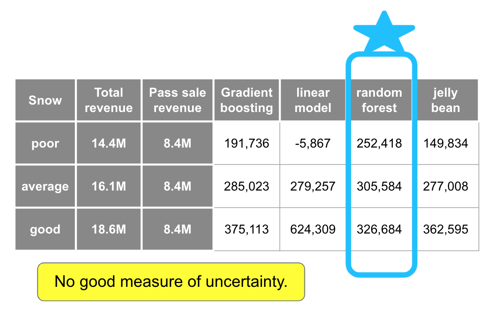
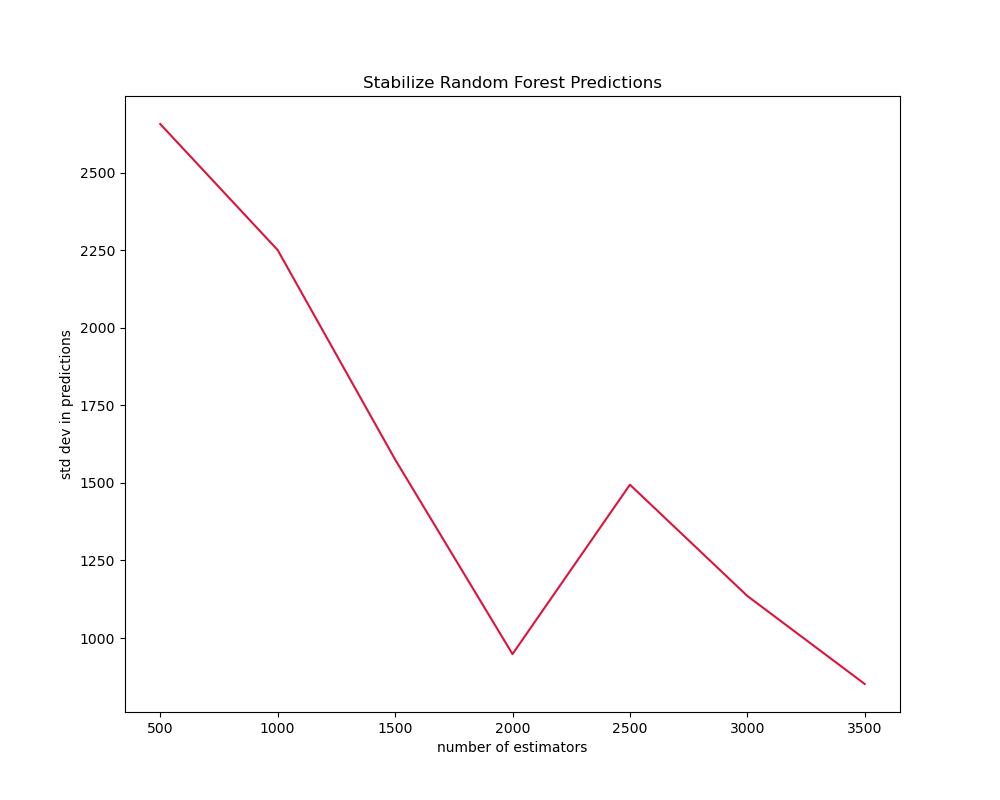

# Bogus Basin Ski Resort Total Visitor Prediction
More fun than useful, prediction of the Bogus Basin total visitor count in season 2021-22. [Presentation](https://www.loom.com/share/58476509cf5d4233a54ad99aff7afe52)

[Introduction](#Introduction)

[Data](#Data)

[Strategies](#Strategies)

- [Sum Daily Predictions](#Sum-Daily-Predictions)

- [Line of Best Fit](#Line-of-Best-Fit)

- [Regression](#Regression)

 - [Features](#Features)

 - [Results](#Results)

- [Conclusion](#Conclusion)

- [Future Work](#Future-Work)

- [Tech Stack](#Tech-Stack)

## Introduction

During our Client Update to Bogus Basin Ski Resort, Adam Little, the chairman, asked what seems like a ver simple and certainly is a very reasonable question, 'How many visitors are coming to Bogus Basin next season?'

The proper response is, we don't know because there simply isn't enough data currently avaialble to answer that question. The more fun response is: let's see what we can do, while responsibly noting our lack of certainty.

## Data

We have data challenges, most formidably, we have only 4 data points! But this is about having some fun and looking forward to more useful results with improved data, both volume and collection.

<!--  -->

 
 

**2017-18 Season**
Local Bogus Basin skier, and zData Data Scientist, Nick Stutzman let us know that Bogus Basin received a grant in 2019 to invest in snow-making equipment. We think the low total visitor count in 2017-18 season was the result of a poor snow year; the possibility that the new equipment precludes low turnout due to low snow depth is pretty exciting, and maybe means this season is not adding pertinent information to our model.

**2018-19**
This season seems complete and uncompromised.

**2019-20**
This season includes 130 good snow days, however the pandemic forced an early end to the season on March 17th, approximately one month of potential data loss.

**2020-21**
The Covid-19 impacted season is very interesting at Bogus Basin. The total visitor count saw a sharp increase that seems to have been driven in large part by an increase in night season pass usage. Being a local (rather than destination) resort combined with outdoor activities being safer, may have made for an aberrantly high visitor count season. 

## Strategies

### Sum Daily Predictions
Our initial project included predicting the total number of day visitors in an effort to flag potentially 'parked-out' days. A 'parked-out' day is one in which the number of visitors arriving by car exceeds 2535, the total number of parking spaces. Bogus Basin estimates this state in total visitors exceeding 5070, two per parking spot. 

We can sum the daily predictions made in the initial project to get total visitor prediction for next season. We also need to sum the uncertainty in those predictions which leaves us with very wide confidence intervals.

<!--  -->

 
 

### Line of Best Fit

Finding a line that minimizes the distance between all four points and that line gives a seemingly high, compared to the data we have, prediction of 422,000 vistors next season.

We note that the steepness in this line is the result of the low 2017-18 value and the high 2020-21 value, both of which may represent aberrant data.

### Regression

In an effort to improve our prediction, we add some strongly related features.

#### Features

##### Snow Depth Feature

The seasonal **snow conditions** look potentially correlated with the total number of visitors count. The pearson correlation is a high 0.88, however with only 4 data points, this is not statistical evidence for the a true correlation (p-value = 0.12).

We can't know next season's snow value to use as a predictor, so how can we use this in our model? We built a model that allows for obtaining different predictions based on *good*, *average* and *poor* seasonal **snow conditions**. 

We need to figure out what range of **average summit depth** constitutes *good*, *average* and *poor* snow seasons.

The last ten seasons of **avarage summit depth** sourced from [OnTheSnow](https://www.onthesnow.com/idaho/bogus-basin/ski-resort.html) give us a way to cluster seasonal **snow conditions** into: *good*, *average* and *poor* years. This clustering was done using the KMeans algorithm.

New predictions from our model will require a *good*, *average* and *poor* input value for **snow condition**.

##### Revenue Features

The initial idea was that **total revenue**, **season pass sales window revenue** and **total visitor counts** all have a strong relationship with the number of season pass holders, and **revenues** may be directly related to **total visitor counts**. 

Like the snow correlation, 4 datapoints are not a good basis for statistical testing of correlation. Though the following finding is not supported by theory (p-value = 0.29), it was unexpected to see a very high negative correlation -0.89, or inverse relationship, between **total revenue** and **total visitor counts**. 

Similarly unsupported by statistical theory (p-value = 0.67), **season pass sales window revenue** has a mild pearson correlation of 0.33. 

Without more data, we cannot properly assess whether **revenue** features are helpful to any of the models in our Model.

###### Total Revenue

> TOTAL REVENUE FEATURE - light green

This feature is excluded from the final model after feedback from Team Ski Resort. With a known figure for total revenue in 2020-21 from which the model can learn, plus Client input that an estimate for next season revenue is a helpful input, this feature could again be included.

Bogus Basin is a non-profit ski resort and a such their tax filings are public record. The **total revenue** value (in light green) is sourced from [ProPublica](https://projects.propublica.org/nonprofits/organizations/820212207). The fiscal year ends in May, so each tax filing corresponds to a complete ski season. The filing for 2020-21 will not be due until August 2022. Our model requires this most recent value in order to use this predictor. It makes sense that Bogus Basin has this number on their internal P&L statment, and can be added to improve the use of this feature. 

For the purposes of building this preliminary demonstration, we will use the previous 9 years' **total revenue** values to fit a line that projects the 2020-21 season value to be 17.3 million dollars. 

For predictions, like the snow value input, different predictions can be generated by inputing different estimations of next season's **total revenue**.

###### Season Pass Sales Window Revenue

> SEASON PASS SALE WINDOW REVENUE FEATURE - dark green

The season pass sale takes place every February, so happily we have this data for the previous 5 years, which covers our 4 years of data for building the  model, and we know this value for next year so that we can use it to make predictions!

 
 

#### Results

WARNING:

 We don't have a reasonable training, validation and holdout scenario. There is no context for tuning hyperparameters or collecting error metrics. With the exception of the number of estimators for the random forest model, models are out-of-the-box sklearn implementations. We do not have a measure of uncertainty.

The boosting model high bias for the original data is alleviated slightly by using XGBoost, but there isn't enough data to allow the boosting models to use their strengths, one Decision Tree gives the same results. 

The linear model is too flexible, indicating that there are **snow conditions** and **revenue values** represented in the data that bring a negative number of visitors to Bogus Basin.

The random forest model is the best performer given this data. The random forest model is producing reasonable results and being responsive to the new data point.

Hyperparameter tuning: we don't have a validation or holdout set, so this tuning is only about finding a sufficient number of estimators to stabilize the random forest prediction. We will increase the default value of 100 to 2000, based on the standard deviations of size 30 samples over the range of 500-3500 in increments of 500. This evaluation is made on the model with only **snow condition** and **season pass sales window** predictors. The model with **total revenue** has a higher standard deviation, and does not achieve a standard error under 1000 with up to 3500 trees.

The feature importance and permutation importances indicate that the **snow condition** is being used most often and most fruitfully in the random forest regression. There is some evidence that a model with only **snow condition** is preferable. We note that these importance results are not robust in the context of only 4 datapoints.

Models are only as good as the data we feed them, and we are starving our poor models. In light of this we also made a Jelly Bean Model. The Jelly Bean Model comes from the idea that guessing the number of jelly beans in a jar is best accomplished by collecting a bunch of wrong guesses and averaging them.  We built multiple models to try to answer this question, so we can also look at jelly bean results.

## Conclusion

We can always get a prediction. What matters is being able to quantify how good that prediction is. 

We did our best to let the data we have speak to us, and we think the best idea of next years visitor count should be heavily weighted by the expertise and domain knowledge of Bogus Basin's board and staff.

Without more historical data, it is hard to use these results meaningfully, we are hoping to build something just as fun and much more helpful in the future, either with more historical data or new data that we start collecting now.

Please [click](https://bogus-basin-prediction.herokuapp.com/) to play with an application that demonstrates making predictions using the random forest model and choosing only a **snow condition** value. 

Please [click](https://bogus-basin-app.herokuapp.com/) to play with an application that demonstrates making predictions using the random forest model and choosing both a **snow condition** value and a **total revenue** value. 

## Future Work

### In progress

- Data collection recommendations
- Dashboard POC
- Week-ahead prediction model for daily visitor counts
- General application for predicting demand

### With additional data

- Image Recognition 
- GPS data 
- Dynamic Pricing 
- Chatbot
- OCR for handwritten records
- Mobile app
- Customer Lifetime Value Prediction

## Tech Stack

<table>
<tr>
<td>

</td>
</tr>
<tr>
<td>

</td>
</tr>
<tr>
<td>

</td>
</tr>
<tr>
<td>
</td>
</tr>
<tr>
<td>

</td>
</tr>
<tr>
<td>

</td>
</tr>
<tr>
<td>

</td>
</tr>
<tr>
<td>

</td>
</tr>
<tr>
<td>

</td>
</tr>
<tr>
<td>

</td>
</tr>
<tr>
<td>

</td>
</tr>
<tr>
<td>

</td>
</tr>

